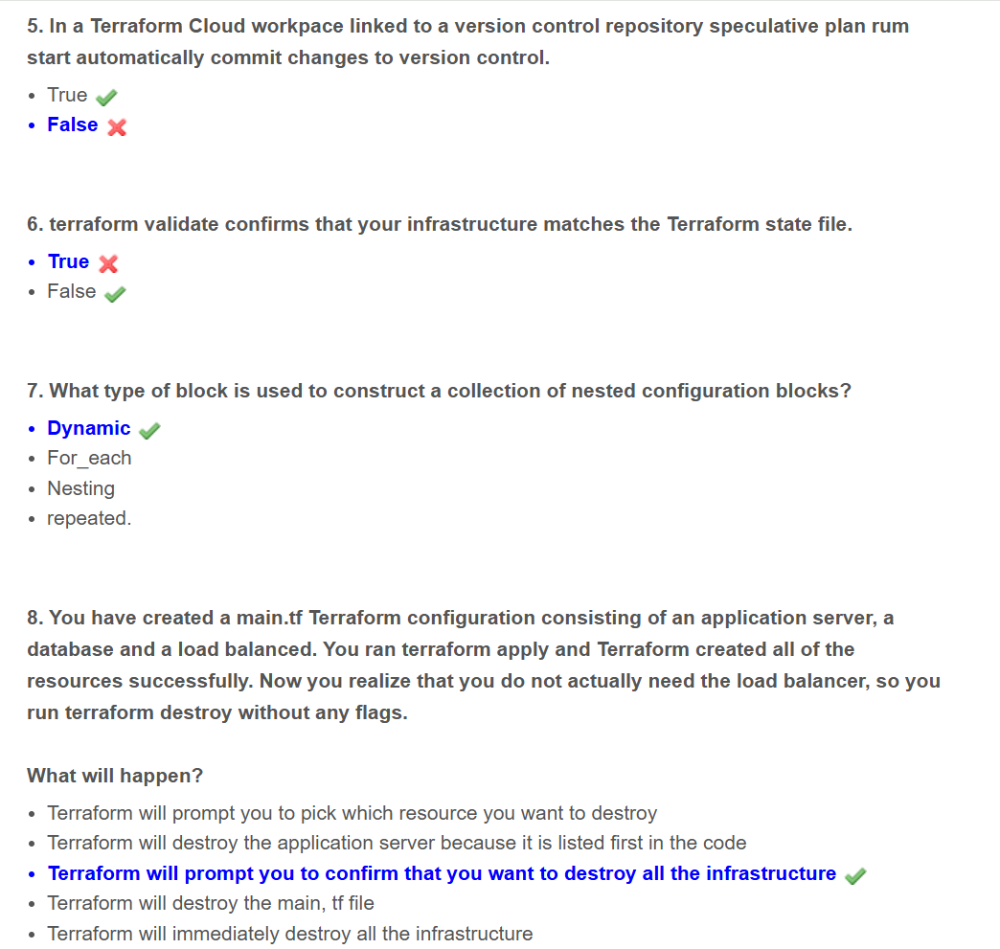

# Terraform-Associate-Exam-Resources
HashiCorp Certified Terraform Associate Practice Exam Q &amp; A.        
Here storing all the resources I have.       

## Note
This repository contains only free resources. We do not sponsor, endorse, or recommend any paid courses or services.        

Prepare for the Terraform Associate (003) Certification Exam: 

Terraform associate certification page:           


## Video course from freeCodeCamp.org 

       

Free Practice exam: https://www.exampro.co/terraform

## Links to Online free exam dumps available:       
[Dumpbase](https://www.dumpsbase.com/freedumps/ta-003-p-exam-dumps-v12-02-are-available-with-the-most-updated-exam-questions-check-ta-003-p-free-dumps-part-1-q1-q40-first.html)            

https://github.com/devenes/HashiCorp-Certified-Terraform-Associate/blob/main/README.md             

## Basic Terraform Commands:    

```bash
terraform init      # Initialize the Terraform working directory
terraform plan      # Preview the changes Terraform will make to match your configuration
terraform apply     # Apply the changes required to reach the desired state
terraform destroy   # Destroy the infrastructure managed by Terraform
terraform fmt       # Automatically reformats all configuration files in the current directory according to HashiCorp's recommended style.
terraform validate  # To check whether the configuaration is valid or not
```

## More Practice Q&A





          


## Disclaimer

While every effort has been made to ensure accuracy, some answers may be incorrect. Please conduct your own research to verify the information. Additionally, the questions provided do not represent actual exam questions. This document is intended solely for testing your knowledge and enhancing your practice.


## Contributing

If you would like to contribute to this repository, please follow the steps below:

1. Fork the repository
2. Create a new branch
3. Make your changes
4. Submit a pull request
5. Wait for the pull request to be reviewed and merged
6. :tada: Celebrate! :tada:
